# **EECS 504 - Project Report**

[TOC]

## 0. Introduction

This project is based on the ECCV 2022 paper "BEVFormer: Learning Bird's-Eye-View Representation from Multi-Camera Images via Spatiotemporal Transformers. It aims to replicate and optimize the BEVFormer framework, a novel approach for autonomous driving perception tasks that utilizes unified Bird's-Eye-View (BEV) representations learned through spatiotemporal transformers. This framework effectively combines spatial and temporal information, interacting with these domains via grid-shaped BEV queries.

We will initially attempt to replicate the core content of this project on the nuScenes test set, implementing and rendering the output results to evaluate the model's performance using the NDS metric. During this phase, the concept of quaternions is crucial to our project, and we plan to create a demo to visualize this process. In the later stages of the project, we will integrate the BEVFormer algorithm into the EasyCV open-source framework, focusing on code optimization in terms of training speed and algorithmic convergence. Additionally, we aim to further enhance the model's performance by utilizing the inference optimization tool PAI-Blade.

## 1. BEVFormer[^1] Implementation

### 1.1 What is BEV

> The video on the right side displays a BEV perspective, which is a top-down, god-like view. In the field of autonomous driving, we can obtain environmental data through cameras or radar and other sensors. The video on the left side shows the footage collected by six cameras. We use algorithms to transform it into the BEV perspective shown on the right, which is then used in downstream tasks.

<video src=".\video1.mp4" muted></video>

### 1.2 Why is BEV

> **The Relative Minor Importance of Elevation Information in Autonomous Driving**: In autonomous driving scenarios, most key information (such as roads, vehicles, pedestrians' positions) can be effectively represented on a two-dimensional plane, making elevation information not critical.
>
> **The Relationship between BEV Space and 3D Space**: BEV space can be seen as a simplified representation of 3D space. It retains location and distance information while reducing processing complexity, mainly focusing on objects and layouts on the ground plane.
>
> **The Convenience of BEV Representation for Multimodal Fusion**: The BEV representation makes it easier to fuse data from different sensors (such as cameras, radars, lidars). This representation provides a common reference framework for different types of sensor data.
>
> **Importance in Pure Vision Systems**: In autonomous driving systems without lidar, the BEV view becomes key in performing perception tasks. It offers a way to fuse and transform sensor data when other 3D observational data is not available.
>
> **Advantages of BEV Semantic Segmentation**: The BEV view relies on cameras from multiple directions, providing richer environmental information than single-direction camera systems like SALM. Even at low speeds, multi-angle views provide stable semantic understanding.

### 1.3 BEV Perception

For the Tesla Model 3, cameras 1, 3, 4, and 5 are used for the pure vision system.

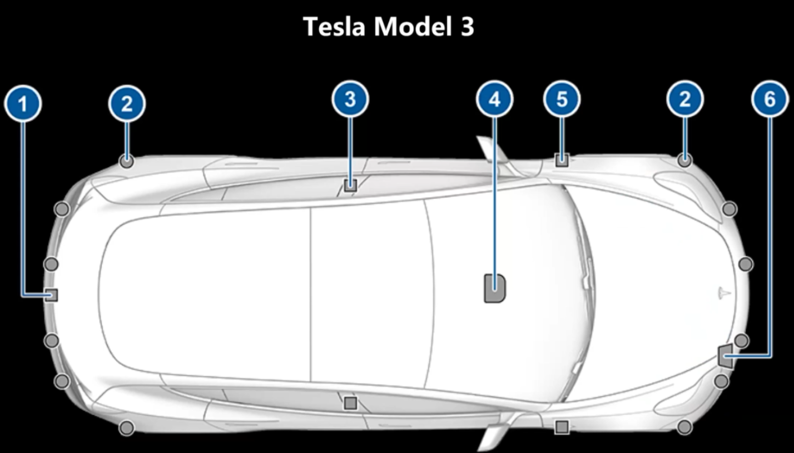

BEV perception has already become a concept encompassing numerous sub-tasks, including classification detection, segmentation tracking, prediction planning, control, and more, with detection being the most common.

Its input can consist of not only camera data but also lidar, camera data, GPS data, etc., among which the most common are camera and lidar point cloud data.

The BEVFormer we have replicated is based on a pure vision algorithm and falls under the category of BEV Camera.

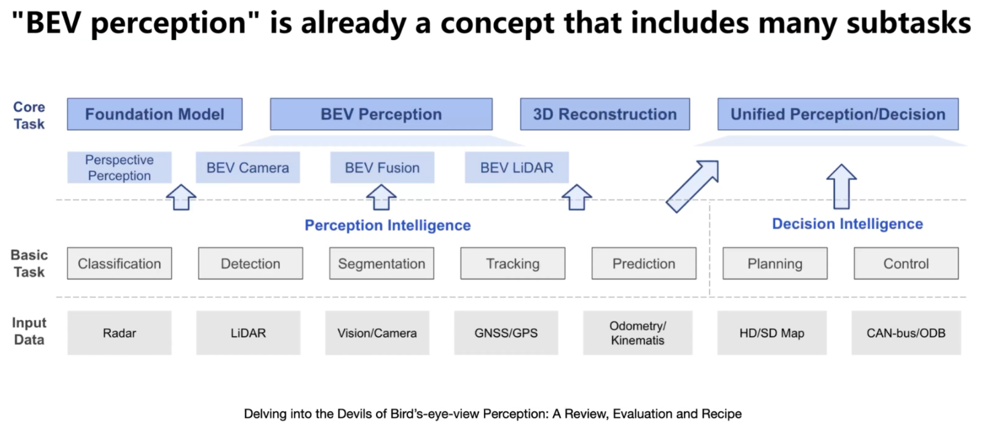

### 1.4 BEV Camera

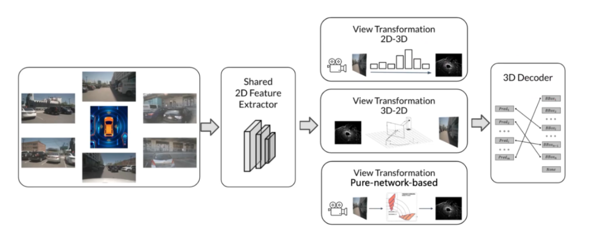

The algorithm's input consists of multiple images from nuScenes' CAM, and the output is for downstream tasks, with 3D object detection as an example shown in the figure.

The first part is a 2D image feature extractor, which uses a network with shared parameters.

The second part (in the middle) is the viewpoint transformation module. Since there are only six perspectives around the vehicle, to perform BEV perception, we need to transform these multi-view 2D images into a bird's-eye view perspective. This is the key focus of BEV Camera.

The third part is a 3D decoder used for the final task, which performs specific detection or segmentation tasks.

### 1.5 BEV Datasets

Common test datasets include Scans, which are point cloud data, and Images, which are image data. We chose to conduct tests on nuScenes[^2], which was collected in Boston and Singapore, containing over 1.4 million images

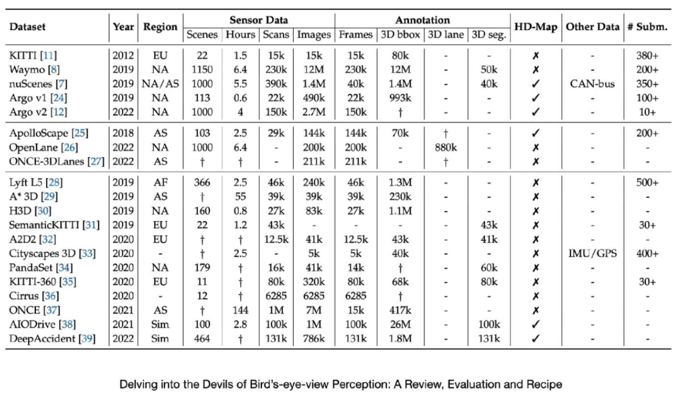

We take `Nuscenes-v1.0-mini` as an example, which is a subset of the `nuScenes` dataset. It contains a small `nuScenes` dataset for rapid prototyping and testing. Below are the meanings of the files and folders in the directory:

- `maps`: Contains map data of the nuScenes dataset.
- `samples`: Contains sample data of the nuScenes dataset, which are annotated keyframe data.
- `sweeps`: Contains scan data of the nuScenes dataset, which are unannotated data.
- `v1.0-mini`: Contains annotated data of the nuScenes dataset, including object annotations, scene annotations, sample annotations, etc.

The following image is an official illustration of the fields in these `json` files. The data provided by `nuScenes` can be treated as a relational database, where desired data can be retrieved through various query statements. The different data are associated through tokens, similar to primary or foreign keys in a database.

- `scene` refers to a video segment of about 20 seconds, `scene.json`.
- A `scene` contains multiple `samples` collected at a frequency of 2Hz, `sample.json`.
- Each `sample` includes multiple `sample_data`, which store the original sensor data. To synchronize the timestamps of all sensors, the timestamps should be very close to that of the `sample` they point to, `sample_data.json`.
- Each `sample` contains multiple `sample_annotations`, which store the information of detection boxes for specific objects appearing in the `sample`, `sample_annotation.json`.
- `instance` refers to the same object being tracked, like the same car annotated in different frames is the same instance. However, the same car across different `scenes` is considered a different instance.

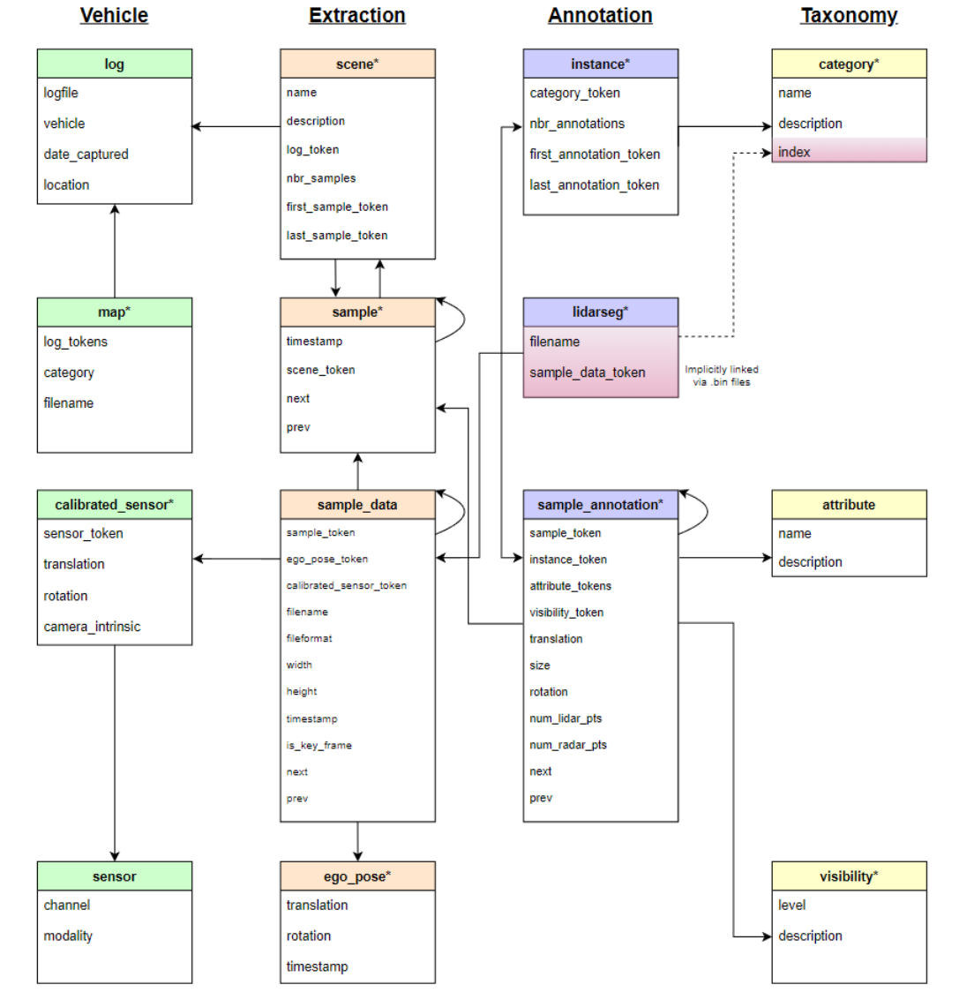

The image shows the test vehicle used during the collection of the nuScenes dataset. The six cameras (CAM) in the picture represent the six viewpoints utilized by the BEVFormer algorithm.

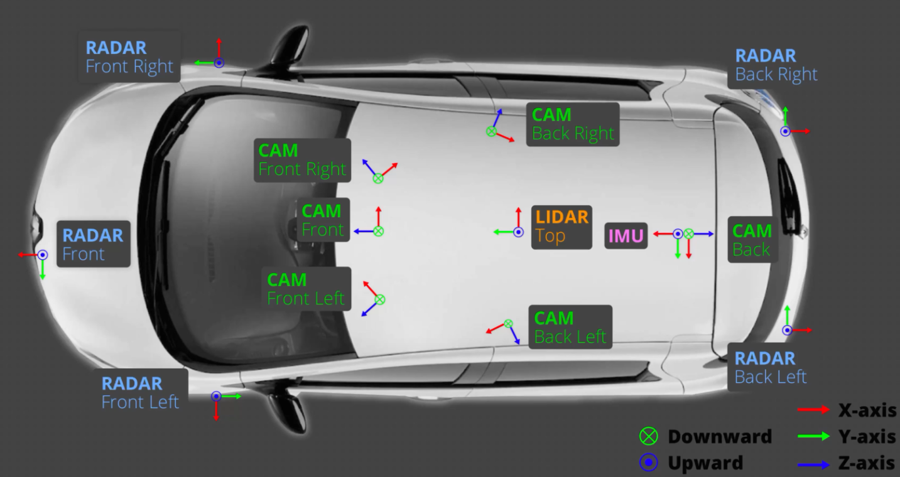

Structure of the nuScenes dataset

> data/nuscenes
>  ├── can_bus
>  ├── nuscenes-v1.0
>  │   ├── maps
>  │   ├── samples
>  │   ├── sweeps
>  │   ├── v1.0-test
>  |   ├── v1.0-trainval
>  |   ├── nuscenes_infos_temporal_train.pkl
>  |   ├── nuscenes_infos_temporal_val.pkl

### 1.6 BEV Former Algorithmic

#### 1.6.1 Overview

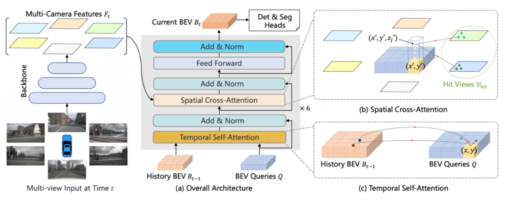

According to the above diagram, the 'backbone' corresponds to the 2D image feature extractor mentioned earlier. Then, in the middle, is the viewpoint transformation module, followed by the detection and segmentation head, corresponding to the 3D decoder mentioned previously.

> **Backbone**
>
> * **Purpose**: To extract features from the cameras surrounding the vehicle at six different angles.
>
> * **Function**: It is used to capture multi-scale features (multi-camera feature) from different cameras. These features will be used for subsequent feature fusion and analysis.

> **BEV Encoder**: This is the core module of BEVFormer, which includes two main parts: Temporal Self-Attention and Spatial Cross-Attention.
>
> - **Temporal Self-Attention**
>   - **Function**: To combine historical BEV features with current BEV features.
>   - **Method**: Uses self-attention mechanism, allowing the model to capture and utilize information across time sequences.
> - **Spatial Cross-Attention**
>   - **Function**: To combine internal and external parameter information of multiple cameras and query multi-camera features.
>   - **Result**: This results in the fusion of multi-camera features under a unified BEV perspective.

> **Det & Seg Head**
>
> - **Purpose**: A head network dedicated to specific tasks.
> - **Application**: Responsible for performing the final 3D detection and segmentation tasks on the fused and processed features.

#### 1.6.2 backbone

At time t, the input of BEVFormal is six images collected by the surround-view cameras. Feeding these six images into the backbone yields the corresponding feature f(t). The official repository uses a CNN, specifically a 101-layer ResNet model, ResNet101, where the input is short-circuited to the output.

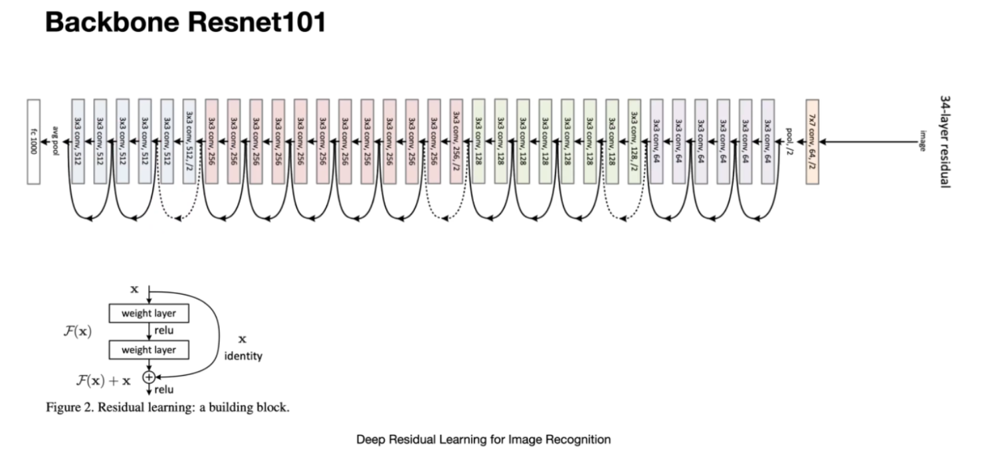

After passing through ResNet101, the authors connected an FPN (Feature Pyramid Network) to enhance the perception of objects at different scales. Therefore, it is composed of the backbone ResNet101 and the FPN pyramid.

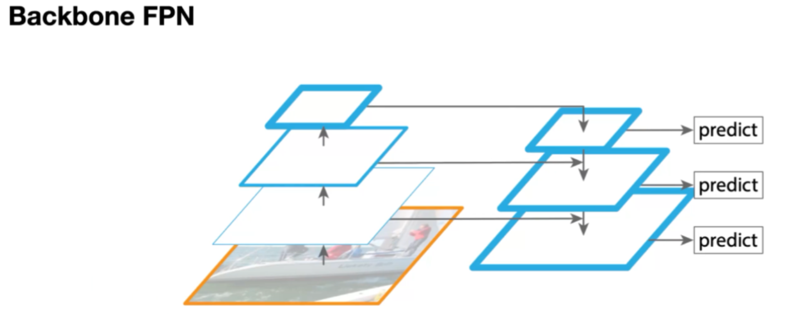

To reduce the large parameter count of the current model, it uses deformable attention modules. In the default module shown in the top-left corner (image 'a'), it performs feature calculations for all positions. On the other hand, 'd' represents the deformable module, which samples key points around objects to reduce computational load.

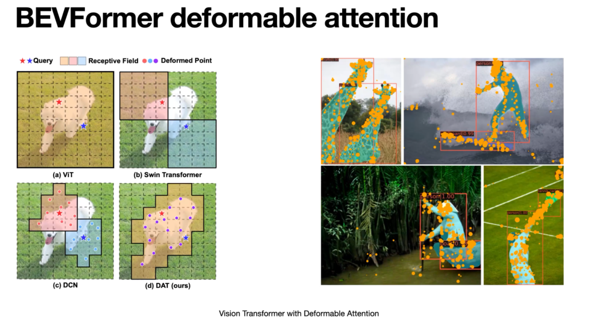
First, some reference points are placed on the image. The specific offsets of these points are learned during training through a module called the "offset network." After learning, it can be observed that these points have been shifted to the cat's body.

Next, based on these offset reference points, the model collects image features and calculates the required keys (k) and values (v) for attention.

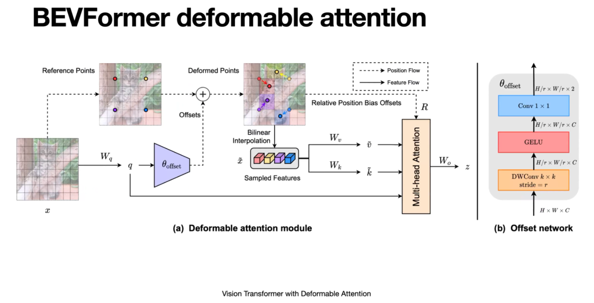

#### 1.6.3 BEVFormer head

BEVFormer uses the deformable DETR decoder's decode module. Deformable DETR is an improvement upon the original object detection model DETR, designed to enhance the speed of both model training and inference.

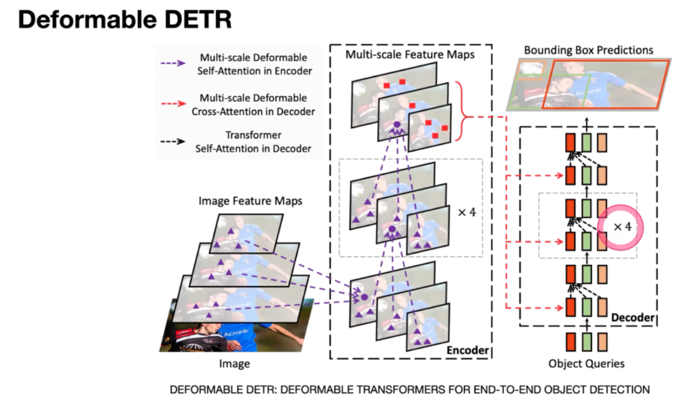

> This section details version 1.6.1, considering whether to add it after explaining 1.6.3 and then returning to the image explanation of 1.6.1:
>
> It needs to convert these multi-perspective two-dimensional images and their features into BEV space. First, it employs something called Temporal Self-Attention, used to locate temporal features in the primary historical features. Additionally, it has a Spatial Cross-Attention to extract spatial location information from multiple camera images. The ultimate goal is detection or segmentation. The reason for collecting temporal information is to estimate the speed of moving objects by comparing features of consecutive frames. With temporal features, it becomes possible to estimate objects that are heavily occluded after movement. There are six sets of such modules. After processing through these modules, the BEV feature obtained at the current time t is B(t). Temporal Self-Attention, at model initialization, creates a learnable parameter q, which is then used to extract temporal information from historical BEV data. This is followed by processing through residual and Norm layers to produce the output. Next comes the use of Cross-Attention. The Query originates from the previous Temporal Self-Attention layer, and k and value are used to extract features from 2D images. Then, through Cross-Attention, spatial location information in image features is obtained, followed by a fully connected layer to produce this output. After undergoing six cycles of this process, we obtain the final BEV feature at time t, B(t). Then, using a 3D detection or segmentation head, we can obtain our final task result.

### 1.7 Implementation

***to be written:  replace image with video***

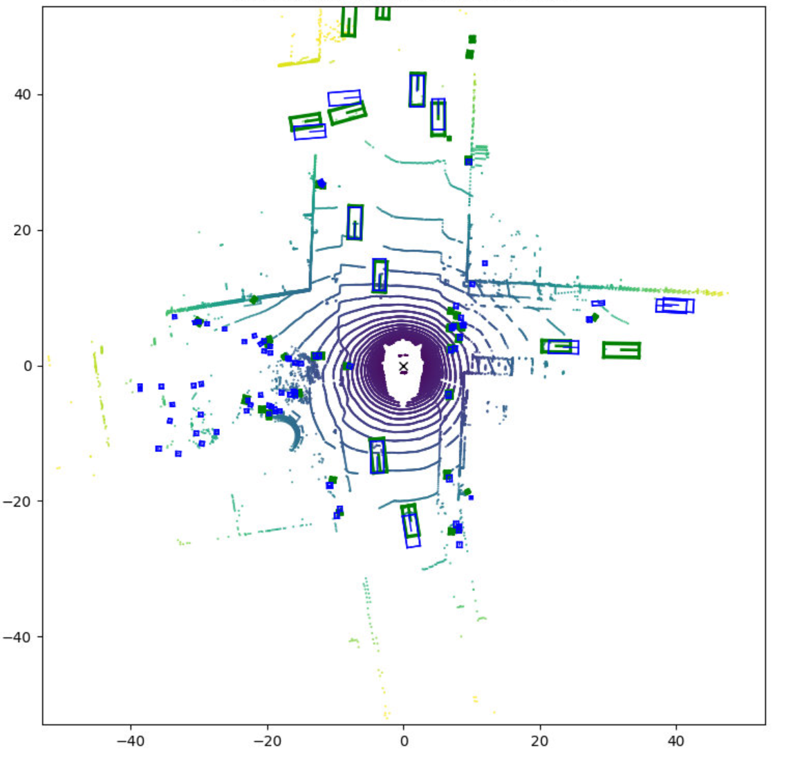

## 2. Accelerate Training

### 2.1  Data Reading Optimization

> **Data Reading**
>
> 1. Use of the more efficient image decoding library turbojpeg instead of libjpeg: This library utilizes SIMD instructions to optimize the compression and decompression process of JPEG images, making it more efficient in handling large quantities or large-sized images.
> 2. Optimization of time-series data reading from serial to parallel: By processing time-series data in parallel, BEVFormer can learn and extract useful features from data faster, thereby enhancing overall learning efficiency and model performance.

> **Memory Copy**
>
> Setting pin_memory=True: This loads data into a fixed (pinned) memory area, accelerating the speed of data transfer from CPU memory to GPU memory.

> **Other**
>
> torch.backends.cudnn.benchmark=True: Enables cuDNN's auto-tuner, which significantly improves performance when the size and dimensions of input data remain constant in each iteration. This can identify the most suitable algorithms for these fixed sizes.

### 2.2 Selection of Loss Function 

> In small datasets, due to the lack of data and imbalance, using Balanced L1 Loss is more beneficial for obtaining more accurate and robust models. This loss function helps achieve better performance under limited data conditions by better balancing errors of different magnitudes.
>
> **L1 Loss:**
>
> - **Definition**: $L(y, \hat{y})=|y-\hat{y}|$
> - **Characteristics**: Sensitive to outliers
>
> **Smooth L1 Loss:**
>
> - **Definition**: A combination of L1 Loss and L2 Loss, it uses L2 Loss for small errors and L1 Loss for large errors.
> - **Characteristics**: Reduces sensitivity to outliers while retaining some advantages of L1 Loss.
>
> **Balanced L1 Loss:**
>
> - **Definition**: An adjustment of Smooth L1 Loss to further balance the impact of different magnitudes of errors during training.
> - **Characteristics**: Provides better gradient balance, especially in dealing with imbalanced or smaller datasets. It effectively handles errors of varying sizes, thus improving accuracy in some tasks.
> - $L_{l o c}=\sum_{i \in x, y, w, h} L_b\left(t_i^u-v_i\right)$

### 2.3 Data Augmentation Optimization

> ```python
> transforms.RandomHorizontalFlip(p=0.5)
> ```

### 2.4 Training Strategy Optimization

> 1. Use one-to-many Branch
>
>    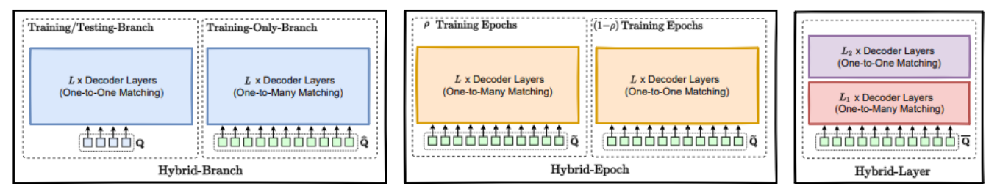
>
>    The DETR detection model[^5] adopts a one-to-one matching approach for assigning Ground Truth (GT) Boxes, eliminating the need for redundant Non-Maximum Suppression (NMS) post-processing. However, since only a few queries are assigned to positive samples, this results in slower convergence during training compared to one-to-many models. Therefore:
>
>    **Introduction of Auxiliary Queries**: In the training process of BevFormer, auxiliary queries similar to those in H-Deformable-DETR are introduced. This helps the model to learn and converge more effectively during training, as more queries are assigned to positive samples.
>
>    **Use of Attention Mask**: The introduction of an attention mask helps to isolate the information of one-to-one and one-to-many branches during training. This facilitates the model's learning of the mapping from multiple queries to a single real target, while maintaining the efficiency of one-to-one predictions during the testing phase.
>
> 2. Use GBGS[^3]
>
>    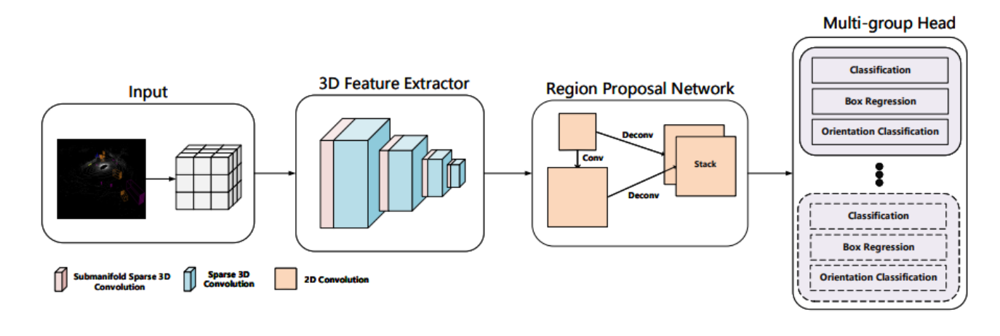
>
>    
>    Class-Balanced Grouping and Sampling is a method used to address the issue of class imbalance. It balances the number of samples among different categories by increasing the resampling frequency of categories with fewer samples. This leads to a more balanced distribution of samples across classes. However, the CBGS operation results in a significant expansion of the entire dataset (for instance, in the case of the nuScenes dataset, it leads to an almost fivefold increase). This is because it augments the sample size of these categories by repetitively sampling the less frequent classes.
>    
>    This method improves model accuracy and helps reduce the model's bias towards majority classes. However, it also increases training costs, requiring longer training times and more computational resources. Excessive resampling of samples may also lead to overfitting to specific samples of minority classes.
>    
>    In the one-to-many Branch, we perform sample balancing operations. For samples with a higher number of instances, fewer auxiliary Queries are used for matching. Conversely, for long-tail samples, more auxiliary Queries are used. This approach maintains consistency with the training time of the base model and further enhances the convergence speed.

### 2.5 Transferring the training to EasyCV[^4]

* Install the ***EasyCV***

```
! pip install --upgrade pai-easycv
```

* Installing ***libturbojpeg*** and Its Dependencies for Data Reading Acceleration[^6]

```python
! apt-get update
! apt-get install libturbojpeg
```

* Training a Model on the ***EasyCV Framework***

```python
! python -m easycv.tools.train bevformer_tiny_r50_nuscenes \
--user_config_params total_epochs=24 data_root="/mnt/workspace/datasets/nuscenes-v1.0-mini/" \
--load_from "/mnt/workspace/pth/pretrain.pth" \
--work_dir "/mnt/workspace"
```

* Making Predictions with a ***BEVFormerPredictor*** Instance

```python
os.chdir('nuscenes-v1.0-mini/')
predictor = BEVFormerPredictor(
    model_path='/mnt/workspace/epoch_24.pth',
    config_file='/mnt/workspace/code/bevformer_tiny_r50_nuscene.py',
)
predictor(mmcv.load('nuscenes_infos_temporal_val.pkl')['infos'][:1])
```

### 2.6 Comparison of Training Results

***to be written***

## 3. Inference Acceleration

Inference acceleration is used to speed up the inference process of deep learning models, which is the process of the model making predictions on new data.

We employed PAI-Blade for inference acceleration. However, understanding ONNX and TensorRT is also essential before using Blade.

### 3.1 ONNX[^7]

ONNX is an open-source project aimed at creating a standard format for representing deep learning models. Its goal is to enable interoperability and sharing of AI models across various deep learning frameworks. It allows for the conversion of models between multiple frameworks like PyTorch, Caffe2, Microsoft Cognitive Toolkit, etc. ONNX is supported by a rich ecosystem of tools and libraries, including model conversion, optimization, and validation tools. This simplifies the deployment process of AI models, especially across different platforms and devices.

### 3.2 TensorRT[^8]

TensorRT is a high-performance deep learning inference engine developed by NVIDIA. It is specifically designed for NVIDIA GPUs to accelerate the inference process of deep learning models. TensorRT enhances efficiency by optimizing model structures and computation graphs, reducing the required computing resources, significantly increasing inference speed, and minimizing GPU resource usage. It is particularly effective for real-time response applications, such as autonomous driving and video analysis, and is compatible with various popular deep learning frameworks.

However, TensorRT offers limited support for front-end framework operator operations and data types. It provides only limited support for dynamic shapes and cannot be used on non-NVIDIA GPU devices. Additionally, it cannot be used across different GPU Compute Capabilities.

### 3.3 PAI-Blade[^9]

Inference acceleration is used to speed up the inference process of deep learning models, which is the process of the model making predictions on new data.

We have used PAI-Blade for inference acceleration, but understanding ONNX and TensorRT is also essential before using Blade.

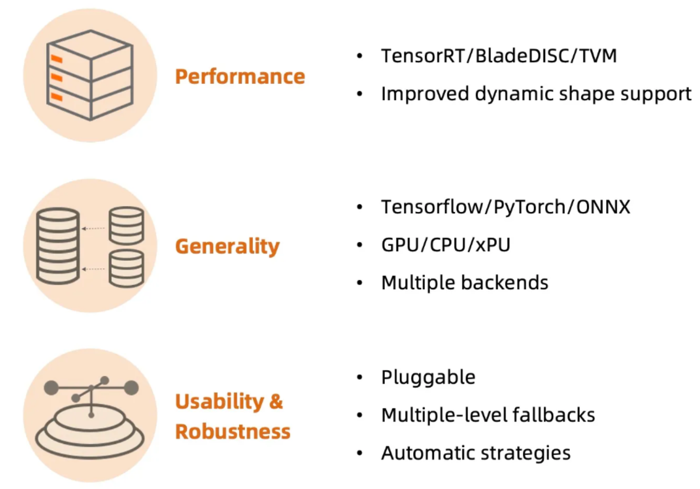

The PAI-EasyCV platform supports Blade, and we use the following inference script.

```python
from easycv.predictors import BEVFormerPredictor

predictor = BEVFormerPredictor(
            model_path='epoch24.pth.blade',
            config_file='/mnt/workspace/code/bevformer_tiny_r50_nuscene.py',
            model_type='blade'
			)
predictor(mmcv.load('nuscenes_infos_temporal_val.pkl')['infos'])
```

## 4. Additional Information and Conclusion

### 4.1 Quaternion

BevFormer uses quaternions to handle the orientation of objects in 3D space. Quaternions are employed to process data from sensors, facilitating object localization and orientation estimation. Inside the network, it performs related orientation transformation calculations.

1. **Avoidance of Gimbal Lock**: Traditional Euler angle representation is prone to the gimbal lock issue, where at certain angles, one degree of freedom is lost, making it impossible to represent some orientations. Quaternions do not have this problem.

2. **Interpolation Efficiency**: Quaternions allow for smooth and efficient orientation interpolation, which is very important in continuous motion estimation.

3. **Computational Efficiency and Stability**: Quaternions are computationally more efficient than Euler angles and rotation matrices, and offer better numerical stability.

4. **The general form of a quaternion is as follows**:
   $$
   q=a+b i+c j+d k
   $$


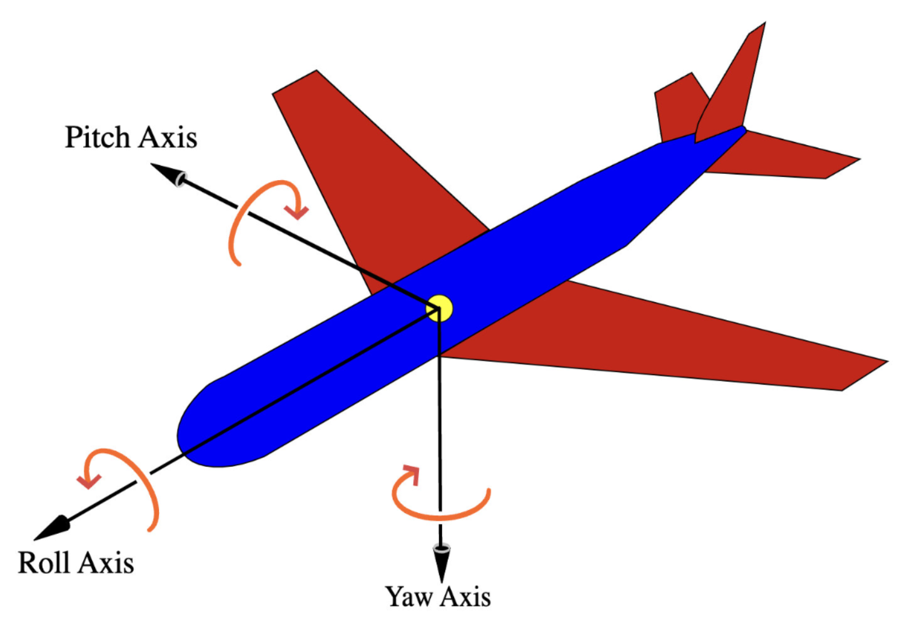

### 4.2 Quaternion Visualization[^10]

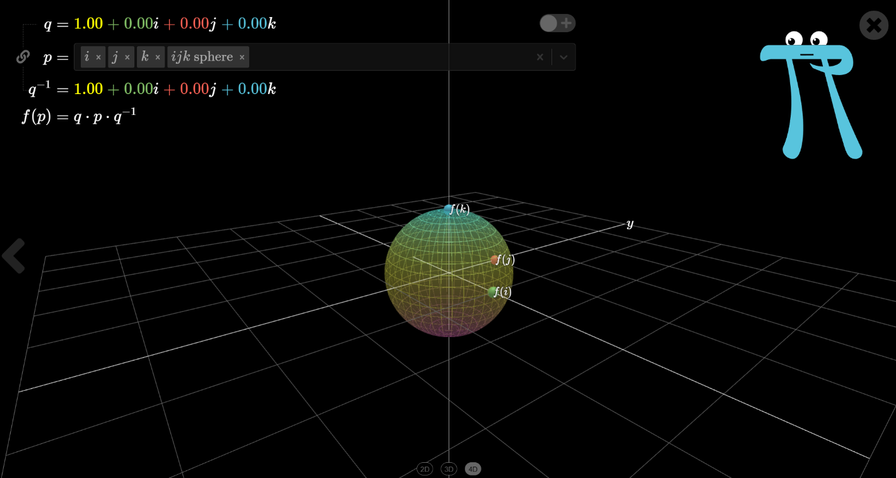

### 4.3 Conclusion

Our comprehensive exploration and advancement of the BEVFormer framework, originally introduced in the ECCV 2022 paper. Our project embarked on a journey to replicate and optimize this novel approach, focusing on the unified Bird's-Eye-View (BEV) representations through spatiotemporal transformers, a critical component for autonomous driving perception tasks. Our first major accomplishment was successfully replicating the BEVFormer model. We rigorously tested it on the mini nuScenes dataset, evaluating its performance using the NDS metric. This initial step was crucial in understanding the framework's capabilities and limitations. In an effort to bring the BEVFormer into a more accessible and usable form, we integrated it into the EasyCV open-source framework. This integration was not only about embedding the model into a new environment; it was about optimizing the code for better training speed and algorithmic convergence. Our goal was to make the BEVFormer not only more efficient but also more adaptable for various applications in autonomous driving. 

## 5. Reference

[^1]: https://arxiv.org/abs/2203.17270
[^2]: https://www.nuscenes.org/download
[^3]:  https://arxiv.org/abs/1908.09492 
[^4]: https://github.com/alibaba/EasyCV
[^5]: https://arxiv.org/abs/2207.13080
[^6]: https://github.com/lilohuang/PyTurboJPEG
[^7]: https://onnx.ai/
[^8]: https://developer.nvidia.com/tensorrt
[^9]: https://www.alibabacloud.com/help/en/pai/user-guide/overview-16
[^10]:  https://eater.net/quaternions/video/intro